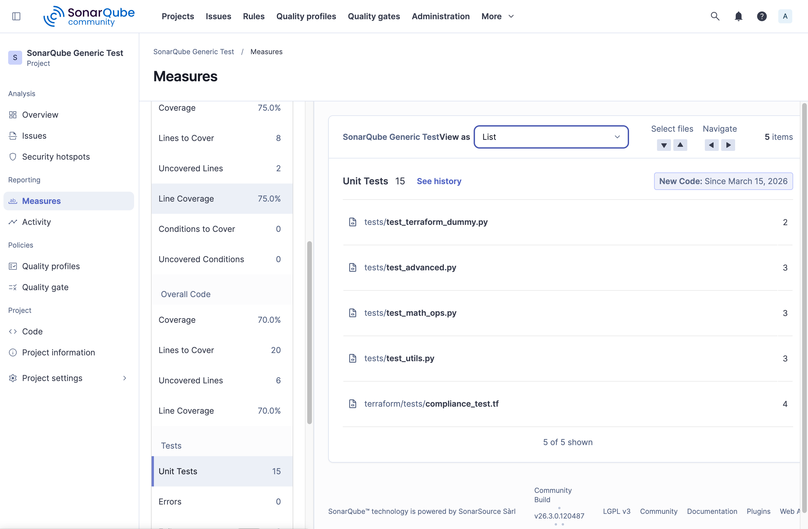
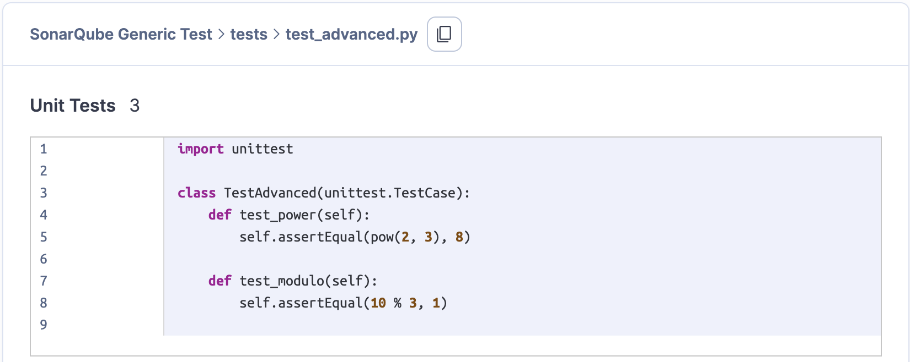
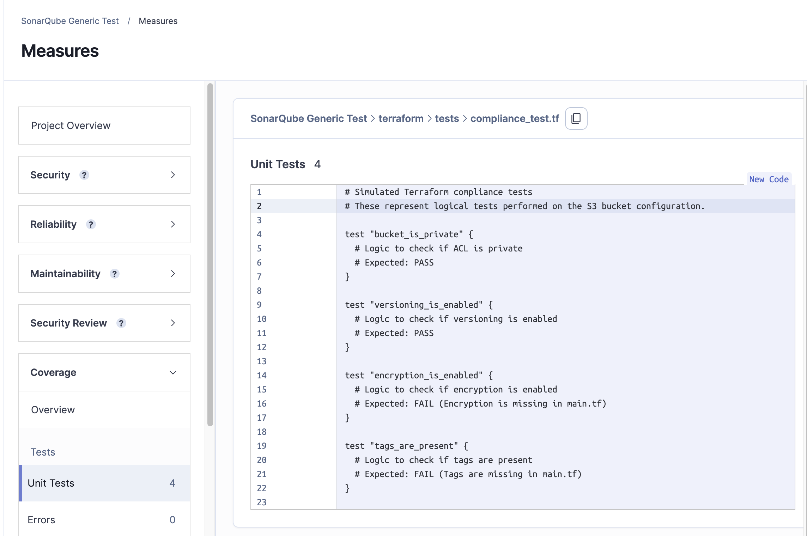

# SonarQube Generic Test Execution & Coverage Demo

This project demonstrates how to use SonarQube's **Generic Test Data** and **Generic Coverage** formats to import results from languages or tools that aren't natively supported (e.g., Terraform compliance tests) alongside standard languages like Python.

## Project Structure

- `src/`: Python source code.
- `tests/`: Python unit tests.
- `terraform/`: Terraform configuration (`main.tf`).
- `terraform/tests/`: Terraform compliance tests (`compliance_test.tf`).
- `reports/`: Generated XML reports for SonarQube ingestion.
- `generate_reports.py`: Python script to generate SonarQube-compatible XML.
- `sonar-project.properties`: Configuration for the SonarQube scanner.
- `scanner_debug.log`: Full verbose output from the SonarQube scanner for deep analysis.
- `docker-compose.yml`: Spins up a local SonarQube and PostgreSQL instance.
- `screenshots/`: Visual evidence of the SonarQube UI and results.

## Getting Started

### 1. Start SonarQube
Ensure Docker Desktop is running, then start the environment:
```bash
docker compose up -d
```
Login at [http://localhost:9000](http://localhost:9000) (Default: `admin`/`admin`).

### 2. Generate Reports
Run the generator script to create the `testExecutions` and `coverage` XML files:
```bash
python3 generate_reports.py
```

### 3. Run Analysis
Use the SonarQube Scanner (via Docker) to submit the results:
```bash
docker run --rm \
  -v "$(pwd):/usr/src" \
  sonarsource/sonar-scanner-cli \
  -Dsonar.host.url=http://host.docker.internal:9000
```

---

## Visual Results & Observations

### 1. Test Results Submitted

*Evidence of the successful submission and ingestion of generic test data into the SonarQube dashboard.*

### 2. Python Test Results Detail

*Detailed view of Python test components.*

### 3. Terraform Test Results Detail

*Detailed view of Terraform test components.*

### Conclusion
**What we see is that SonarQube is not showing the unit test results per unit test, only at an overall file level.**

---

## Implementation History: The Path to Success

To achieve a successful generic test submission, we followed these key architectural steps:

1.  **Environment Isolation**: Established a reliable local SonarQube instance using Docker Compose with an external PostgreSQL database for persistence.
2.  **Generic XML Generation**: Developed a Python script (`generate_reports.py`) to map diverse test results (Python `unittest` and Terraform `compliance`) into the [SonarQube Generic Test Execution](https://docs.sonarsource.com/sonarqube/latest/analyzing-source-code/test-coverage/generic-test-data/#generic-test-execution) XML format.
3.  **Dynamic Coverage Mapping**: Implemented a dynamic line-coverage generator that calculates file lengths to ensure the `coverage.xml` always matches the physical source files, preventing sensor parsing errors.
4.  **Strict Source vs. Test Classification**: Refined `sonar-project.properties` to explicitly separate `sonar.sources` from `sonar.tests`. This was critical for ensuring that:
    - **Source files** (like `main.tf`) show **Coverage** (green/red bars).
    - **Test files** (like `compliance_test.tf`) show **Execution Results** (pass/fail counts).
5.  **UI Optimization**: Enhanced the XML report with `classname` attributes and explicitly included test patterns in `sonar.test.inclusions` to ensure the SonarQube UI correctly attributed results to the appropriate components.
6.  **Scanner-to-Host Communication**: Configured the Docker-based scanner to communicate with the host-bound SonarQube instance using `host.docker.internal`, allowing for a seamless local development loop.
