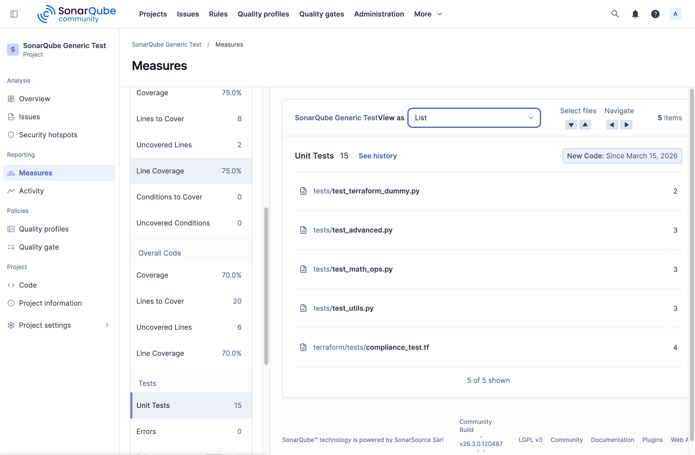
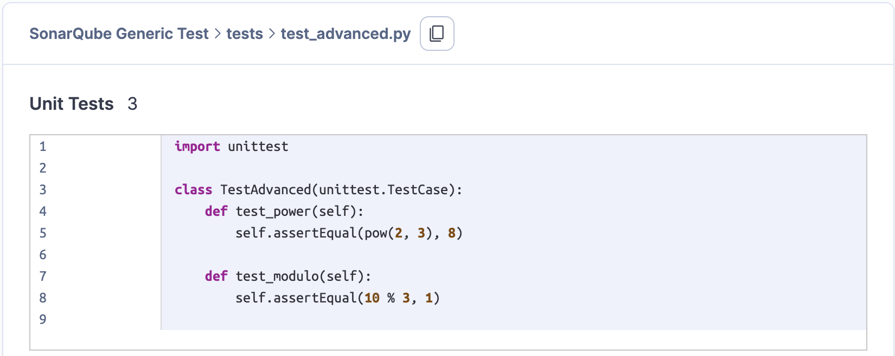
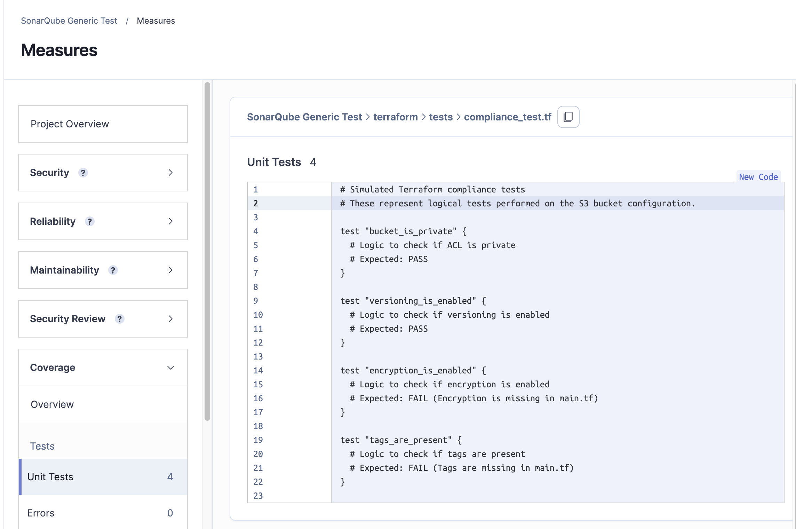
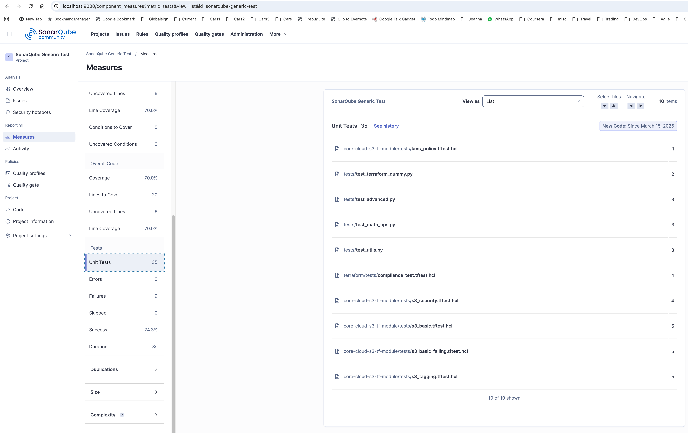
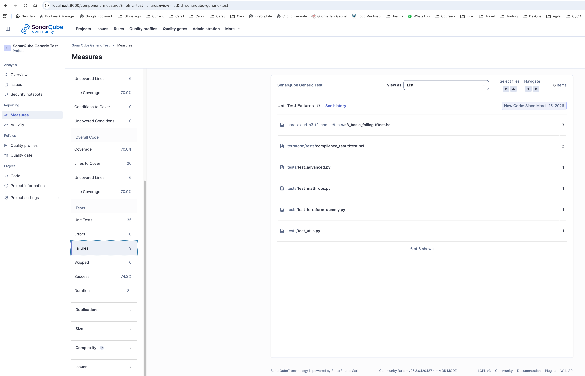
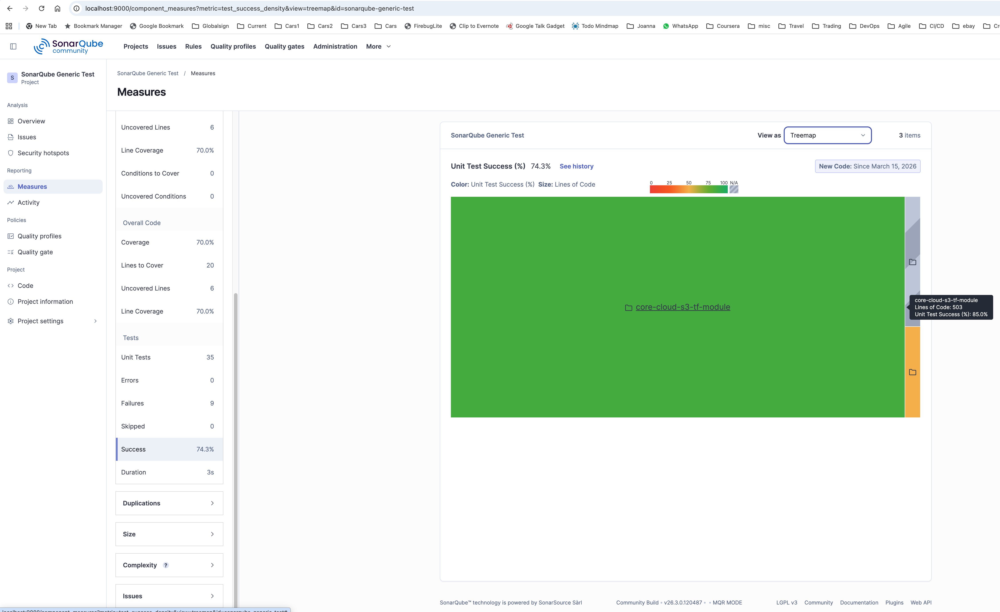
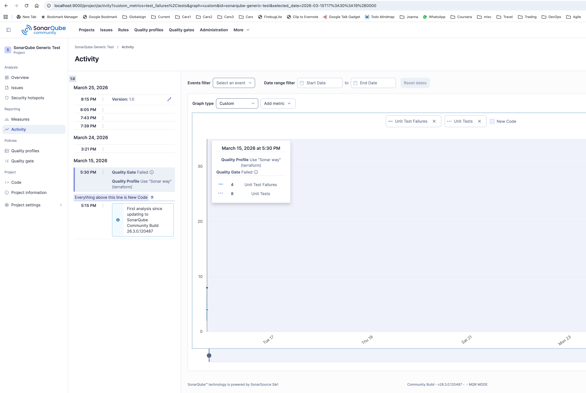

# SonarQube Generic Test Execution & Coverage Demo

This project demonstrates how to use SonarQube's **Generic Test Data** and **Generic Coverage** formats to import results from languages or tools that aren't natively supported (e.g., Terraform compliance tests) alongside standard languages like Python.

> [!WARNING]
> **💡 SonarQube Shortcoming 1** - The generic test execution format viewer doesn't seem to support going down to the individual test method level, and just reports at the file level which is a bit peeving. :-(
> 
> **💡 SonarQube Shortcoming 2** - Wildcards are not supported for generic test execution!
> From the [SonarQube Docs](https://docs.sonarsource.com/sonarqube-server/analyzing-source-code/test-coverage/generic-test-data):
> > **Generic test execution report format:** Report paths should be passed in a comma-delimited list to `sonar.testExecutionReportPaths`
## Quickstart

From the repository root:

```bash
brew install python3
brew install uv
brew tap hashicorp/tap
brew install hashicorp/tap/terraform awscli

uv venv --python python3 .venv
uv pip install pytest

uv run pytest

# Generate the fake reports to just check that we understand the working format
uv run generate_reports.py

# Run terraform test, produce junit output then build sonarqube generic test excecution file from it.
./build.sh


```

You also need either Docker or Podman to be installed.
If using Docker, ensure Docker Desktop is running.

Then bring up the SonarQube Server with:
```bash
docker compose up -d
```
And submit the generated results with:
Note: this gathers a list of files to submit as rexexps don't work for sonarqube generic test execution
```bash
./submit_results_d.sh
```
Or for Podman:
```bash
./submit_results_p.sh
```

Note: `./build.sh` returns a non-zero exit code when any Terraform test file fails (which is expected since `s3_basic_failing.tftest.hcl` intentionally fails).

## Project Structure

- `src/`: Python source code.
- `tests/`: Python unit tests.
- `terraform/`: Terraform configuration (`main.tf`).
- `terraform/tests/`: Terraform compliance tests (`compliance_test.tf`).
- `reports/`: Generated XML reports for SonarQube ingestion.
- `junit_to_sonar.py`: Python script to generate SonarQube-compatible XML from junit format.
- `sonar-project.properties`: Configuration for the SonarQube scanner.
- `scanner_debug.log`: Full verbose output from the SonarQube scanner for deep analysis.
- `docker-compose.yml`: Spins up a local SonarQube and PostgreSQL instance.
- `screenshots/`: Visual evidence of the SonarQube UI and results.
- `generate_reports.py`: Generate fake data in the right format.
- `build.sh`: Run Terraform test and generate sonarqube generic test execution file from it.
- `submit_results_d.sh`: Submit the generated results to SonarQube using Docker.
- `submit_results_p.sh`: Submit the generated results to SonarQube using Podman.
- `validate_sonar_xml.py`: Check the for correct format against the xsd schema.


## Tooling

- **Python environment**: [`uv`](https://github.com/astral-sh/uv) using a local `.venv` in the repository root.
- **Python test framework**: `pytest`.
- **Terraform testing**: `terraform test` with per-file JUnit XML output from `build.sh`.
- **JUnit to Sonar conversion**: `junit_to_sonar.py` converts JUnit XML to SonarQube generic `testExecutions` XML.
- **Infrastructure tooling**: Terraform and AWS CLI.
- **Analysis tooling**: SonarQube scanner via Docker/Podman.

## Getting Started

### 0. Install Required Tooling

```bash
brew install python3
brew install uv
brew tap hashicorp/tap
brew install hashicorp/tap/terraform awscli
uv venv --python python3 .venv

uv pip install pytest
uv run pytest
uv run generate_reports.py

./build.sh
```

Check versions:

```bash
python3 --version
uv --version
terraform --version
aws --version
```

### 1. Create the Python Virtual Environment (uv)

From the repository root:

```bash
uv venv --python python3 .venv
uv pip install pytest
```

Optional activation:

```bash
source .venv/bin/activate
```

If you do not activate the environment, run commands with `uv run`:

```bash
uv run pytest -q
```

### 2. Start SonarQube
Ensure Docker Desktop or Podman is running, then start the environment:

**With Docker Compose:**
```bash
docker compose up -d
```

**With Podman Compose:**
```bash
podman-compose up -d
```
If the scripts are not yet executable, run:
```bash
chmod +x *.sh *.py
```

Login at [http://localhost:9000](http://localhost:9000) (Default: `admin`/`admin`).

### 3. Generate a Security Token Via the API

You can generate a scanner token via the API or the UI. If one already exists with the same name, the command will fail. You can manage tokens at [http://localhost:9000/account/security](http://localhost:9000/account/security).

**Extract and save the token to `.env` using jq - will prompt for password:**
```bash
curl -u admin -X POST "http://localhost:9000/api/user_tokens/generate?name=scanner-token" | jq -r '.token' | xargs -I{} sh -c 'echo SONAR_TOKEN={} > .env'
```
> [!NOTE]
> This command uses `jq` to cleanly extract the token and write it to the `.env` file. By including `--env-file .env` in the Docker command, you can reference `sonar.token=${SONAR_TOKEN}` in your `sonar-project.properties`.

Then apply the minimum recommended baseline hardening:

```bash
chmod 600 .env
```

*(Why this is reasonable: `.env` is already ignored by `.gitignore`, and `chmod 600` limits read/write access to your user account only.)*

See the bottom of this README for an alternative Keychain-based solution without using `.env`.

**Via UI:**
1. Go to **My Account** (top right) -> **Security**.
2. Under **Generate Token**, give it a name and click **Generate**.

### Update Admin Password & Create Local Project

Log in and update the default `admin`/`admin` password if prompted. Then, manually create a local project with these settings:
- **Project Key:** `sonarqube-generic-test`
- **Display Name:** `sonarqube-generic-test`
- **Project Version:** `1.0`
- **Main Branch Name:** `main`


### 4. Run Python Tests (pytest)

```bash
uv run pytest
```

### 5. Generate Reports
Run the generator script to create the `testExecutions` and `coverage` XML files:
```bash
uv run generate_reports.py
```

### 6. Run Terraform Module Build and Test Reports

The module build script runs:

- `terraform init`
- `terraform plan`
- `terraform test` for each `.tftest.hcl` file
- JUnit XML generation per test file
- Sonar generic test execution XML conversion per test file

```bash
./build.sh
```

Generated outputs are written to `generated/`.

#### build.sh details

- Script path: `build.sh`.
- Test discovery pattern: `core-cloud-s3-tf-module/tests/*.tftest.hcl`.
- Per-test execution: each discovered test file is run individually using Terraform `-filter`.
- JUnit output per test file: `*.junit.xml`.
- Sonar generic execution output per test file: `*.sonar.xml` (via `junit_to_sonar.py`).
- Aggregate test log: `terraform-test-results.txt`.
- Plan artifacts: `terraform.plan` and `terraform-plan.txt`.

Typical generated files:

- `generated/kms_policy.junit.xml`
- `generated/kms_policy.sonar.xml`
- `generated/s3_basic.junit.xml`
- `generated/s3_basic.sonar.xml`
- `generated/terraform-test-results.txt`

Exit behavior:

- `0`: plan succeeds and all discovered test files pass.
- Non-zero: plan fails, or at least one test file fails (for example `s3_basic_failing.tftest.hcl`).

### 7. Run Analysis
Use the SonarQube Scanner to submit the results:

*Note: In the Docker command, `--rm` removes the container automatically when it exits, and `-v "$(pwd):/usr/src"` mounts your current project directory into the container so the scanner can read your source files and report XML files.*

Recommended helper scripts:

- Docker: `./submit_results_d.sh`
- Podman: `./submit_results_p.sh`

Both scripts forward extra scanner arguments, for example:

```bash
./submit_results_d.sh -Dsonar.log.level=DEBUG
```

**With Docker:**
```bash
./submit_results_d.sh
```

**With Podman:**
```bash
./submit_results_p.sh
```
*Note: Podman uses `host.containers.internal` instead of `host.docker.internal` for host communication.*

---

## Visual Results & Observations

### 1. Test Results Submitted

*Evidence of the successful submission and ingestion of generic test data into the SonarQube dashboard - this was built rather than live but proved the concept*

### 2. Python Test Results Detail

*Detailed view of Python test components*

### 3. Terraform Test Results Detail

*Detailed view of Terraform test components*

### 4. Terraform UnitTests

*View of Terraform UnitTests - this was converted from a real terraform test run using junit_to_sonar.py*

### 5. Terraform UnitTest Failures

*View of Terraform UnitTest Failures - this was converted from a real terraform test run using junit_to_sonar.py* 

### 6. Treemap

*View of Treemap most of the code passes but shows some test failures*

### 7. ActivityGraph

*View of ActivityGraph*

## Conclusion

**We have successfully demonstrated the ability to submit generic test results to SonarQube.**

**What we see is that SonarQube file viewer is not showing the unit test results per unit test, only at an overall file level.**

---

## Implementation History: The Path to Success

To achieve a successful generic test submission, we followed these key architectural steps:

1.  **Environment Isolation**: Established a reliable local SonarQube instance using Docker Compose with an external PostgreSQL database for persistence.
2.  **Generic XML Generation**: Developed a Python script (`generate_reports.py`) to map diverse test results (Python `unittest` and Terraform `compliance`) into the [SonarQube Generic Test Execution](https://docs.sonarsource.com/sonarqube/latest/analyzing-source-code/test-coverage/generic-test-data/#generic-test-execution) XML format.
3.  **Dynamic Coverage Mapping**: Implemented a dynamic line-coverage generator that calculates file lengths to ensure the `coverage.xml` always matches the physical source files, preventing sensor parsing errors.
4.  **Strict Source vs. Test Classification**: Refined `sonar-project.properties` to explicitly separate `sonar.sources` from `sonar.tests`. This was critical for ensuring that:
    - **Source files** (like `main.tf`) show **Coverage** (green/red bars).
    - **Test files** (like `compliance_test.tftest.hcl`) show **Execution Results** (pass/fail counts).
5.  **UI Optimization**: Enhanced the XML report with `classname` attributes and explicitly included test patterns in `sonar.test.inclusions` to ensure the SonarQube UI correctly attributed results to the appropriate components.
6.  **Scanner-to-Host Communication**: Configured the Docker-based scanner to communicate with the host-bound SonarQube instance using `host.docker.internal`, allowing for a seamless local development loop.
7.  **Path Resolution Hack**: SonarScanner expects test file paths in the generic XML to perfectly match the indexed paths relative to the project root. Since `terraform test` runs inside the module directory, the generated paths were previously misaligned. This was cleanly fixed natively without sed by passing a `--prefix core-cloud-s3-tf-module` argument to `junit_to_sonar.py`, which seamlessly maps the paths back to the project root for SonarQube.


## Bonus points: Keychain-based token storage (macOS)

If you want to avoid storing the token in `.env`, you can store it in macOS Keychain and inject it at runtime.

1. Save token in Keychain once:

```bash
security add-generic-password -a "$USER" -s sonar_token -w "<your-sonar-token>" -U
```

2. Export token into your shell for the current session:

```bash
export SONAR_TOKEN="$(security find-generic-password -a "$USER" -s sonar_token -w)"
```

3. Use scanner commands with environment passthrough instead of `--env-file .env`:

```bash
docker run --rm \
  -e SONAR_TOKEN \
  -v "$(pwd):/usr/src" \
  sonarsource/sonar-scanner-cli \
  -Dsonar.host.url=http://host.docker.internal:9000
```

```bash
podman run --rm \
  -e SONAR_TOKEN \
  -v "$(pwd):/usr/src" \
  sonarsource/sonar-scanner-cli \
  -Dsonar.host.url=http://host.containers.internal:9000
```

[Sonar Community](https://community.sonarsource.com/t/does-sonar-testexecutionreportpaths-support-wildcard/104525)
https://stackoverflow.com/questions/57466369/

sonarqube-test-report-report-refers-to-a-file-which-is-not-configured-as-a-test#:~:text=You%20might%20get%20an%20error%20message%20that,*%20sonar.test.inclusions=src/__test__/**/*.test.ts%2Csrc/**/*.spec.ts%20*%20Adding%20sonar.tests=.(same%20as%20sonar.sources)

https://docs.sonarsource.com/sonarqube-server/2025.4/analyzing-source-code/test-coverage/test-execution-parameters

Key Considerations for sonar.testExecutionReportPaths:

No Wildcards: If wildcards are not explicitly noted for a property in SonarQube documentation, they are not supported.

Comma-Delimited List: Use sonar.testExecutionReportPaths=report1.xml,report2.xml.


Alternative Properties: Other parameters, such as sonar.cs.xunit.reportsPaths or sonar.python.xunit.reportPath, do support wildcards, notes Sonar Documentation.

## Debugging
Use the SonarScanner -X switch to debug ingestion and file path resolution.

## Workaround
Use a script to consolidate multiple report files into a single report, or pass the full list of files in the analysis command. 

# Cause of the Error
The cause of the error FileNotFoundException: /usr/src/generated/*.sonar.xml is actually a known limitation of SonarQube: the sonar.testExecutionReportPaths parameter does not support wildcards. Because it couldn't expand the *.sonar.xml glob, the scanner treated it as a literal file name and tried to open a file explicitly named *.sonar.xml, which caused the crash.

## How I fixed it

I removed the wildcard generated/*.sonar.xml from sonar-project.properties.

I updated both submit_results_d.sh and submit_results_p.sh so that before starting the Docker/Podman container, they dynamically find all .sonar.xml files in the generated/ directory, concatenate them into a comma-separated list, and explicitly pass them to the scanner via -Dsonar.testExecutionReportPaths.

